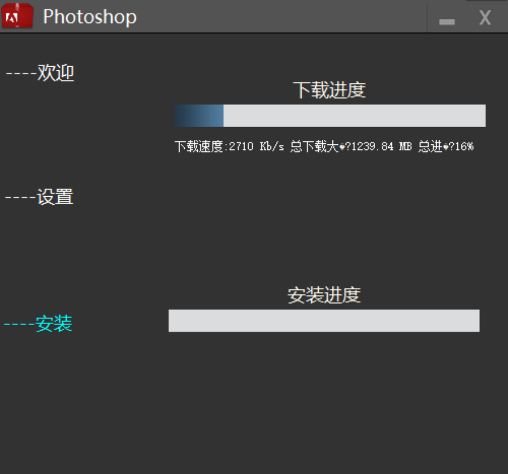

[TOC]

# 运行图片





# 目录和代码文件说明

> UnPack:自解压安装程序的相关代码 
>
> ​			因为程序包含多个dll和资源文件,故使用7z格式统一打包至exe中,该目录的相关代码即为释放资源功能
>
> res:本项目所使用和duilib加载的相关资源文件
>
> src:项目的源代码

## 项目相关代码文件说明:

### [api.cpp](..\src\api.cpp)

提供部分功能供程序内外使用

部分功能有:

```c++
//判断文件\目录是否存在
bool FindFirstFileExists(LPCTSTR lpPath, DWORD dwFilter = 0);
//字符转换相关API(多字节转宽字符,编码转换等)
{
    string WCharToMByte(LPCWSTR lpcwszStr);
    wstring UTF8ToUnicode(const char* strSrc);
    string UnicodeToAnsi(const WCHAR* strSrc);
    string UTF8ToAnsi(const char* strSrc);
}
//获得windowsbuilds版本号.如10.0.19041.xxx 返回19041
DWORD getwinverdwBuildNumber();
//统计设备显卡数量
int CountvAdapersMounts();
//解析配置文件(ini) 后续将改用json
void _parserjsonfile(iinfo *&a,const char* filename);
//Windows Visita+ 新式目录选择器api
wstring folder_open_dialog();
//检查显存是否满足需求
bool isVmemorysatisfied(size_t &memsize,wstring &devicesname);
//判断程序是不是以管理员权限运行
BOOL ExeIsAdmin();
//字符串处理:
string& replace_all(string& src, const string& old_value, const string& new_value);
//任务栏进度条API相关类的定义
class progress;
```

### [Cmainwnd.cpp](..\src\Cmainwnd.cpp)

duilib主窗口类的相关代码

```c++
//环境检查标志图标
{
	static inline auto warningflag()->CControlUI*;
    static inline auto errorflag()->CControlUI*;
    static inline auto acceptflag()->CControlUI*;
}
//环境检查成员函数
//检查管理员权限,系统版本,显卡显存大小是否满足,显卡是否支持DirectX12
void CMainWnd::environmental_inspection();
//检查云端更新成员函数
void CMainWnd::checkp();
//从云端/配置文件下载.7z安装资源文件成员函数
void CMainWnd::downloadpack();
//当选择了目录以使目录改变时自动调用的成员函数 功能包含检查空间是否充足
void CMainWnd::dirchanged(bool once);
//duilib通知消息处理成员函数
void CMainWnd::Notify(TNotifyUI& msg);
//控件初始化,配置初始化,运行环境初始化,运行环境检查成员函数
//相关初始化的控件
{
    m_pStepTabLayout = static_cast<CAnimationTabLayoutUI*>(m_pm.FindControl(_T("stepTabLayout")));
	nowver = static_cast<CCheckBoxUI*>(m_pm.FindControl(_T("nowver")));
	dir = static_cast<CEditUI*>(m_pm.FindControl(_T("dir")));
	needspace = static_cast<CLabelUI*>(m_pm.FindControl(_T("needspace")));
	extspace = static_cast<CLabelUI*>(m_pm.FindControl(_T("extspace")));
	m_pProgressBar = static_cast<CProgressUI*>(m_pm.FindControl(_T("install")));
	m_download = static_cast<CProgressUI*>(m_pm.FindControl(_T("download")));
	pver = static_cast<CLabelUI*>(m_pm.FindControl(_T("pver")));
	nver = static_cast<CLabelUI*>(m_pm.FindControl(_T("nowver")));
	next3 = static_cast<CButtonUI*>(m_pm.FindControl(_T("next3")));
	next2 = static_cast<CButtonUI*>(m_pm.FindControl(_T("next2")));
	list = static_cast<CListUI*>(m_pm.FindControl(_T("enr")));
	speed = static_cast<CLabelUI*>(m_pm.FindControl(_T("speed")));
}
void CMainWnd::Init();
//点击安装后触发的成员函数
//功能:不允许下载\安装时时关闭程序,检查资源包的md5,若文件不存在\md5不正确重新下载,解压安装,脚本安装等
void CMainWnd::InstallStart();
//安装结束后调用
void CMainWnd::InstallFinished();
```

### [download.cpp](..\src\download.cpp)

libcurl多线程下载\显示下载速度\下载进度api

**!).由于当前存在的一个未知严重问题,64位环境下libcurl会崩溃,故本段不适用于64位**

```c++
//跳过https验证宏定义 目前已进行了api设置验证文件验证,该宏暂时无用
#define forcehttpspass(x) curl_easy_setopt(x, CURLOPT_SSL_VERIFYPEER, FALSE);
//pthread
struct tNode
{
	FILE* fp;
	int startidx;
	int maxidx;
	void* _curl;
	pthread_t _tid;
};
//pthread线程:通过windowsAPI获取下载速度 
//不使用libcurl内置速度显示API原因:32位环境 会报nullptr Error
void* GetInternetSpeed(void* arg);
//下载callback函数:显示下载进度
int assetsManagerProgressFunc(void* ptr, double totalToDownload, double nowDownloaded, double totalToUpLoad, double nowUpLoaded);
//pthread:工作线程函数 用于多线程下载
void* workThread(void* pData);
//下载主函数
bool downLoad(int threadNum, std::string _packageUrl, std::string _storagePath, bool show);
```

### [main.cpp](..\src\main.cpp)

程序的主入口

包含duilib库资源初始化

### [openssl_lib.cpp](..\src\openssl_lib.cpp)

openssl库中本项目所需的API

```c++
//获取MD5
extern "C" int get_file_md5(const string & file_name, string & md5_value);
```

### [releasefile.cpp](..\src\releasefile.cpp)

功能:从res中释放文件

```c++
bool CReleaseDLL::FreeResFile(unsigned long m_lResourceID, const char* m_strResourceType, const char* m_strFileName);
```

### [framework.h](..\src\framework.h)

用于声明导出的函数和一些杂项配置

```c++
extern "C"{
	int _declspec(dllexport) Exfile(const char* filename, const char* outdir/*为空时解压在当前目录*/, std::string passwords /*NULL时没有密码*/);
	DWORD _declspec(dllexport) getwinverdwBuildNumber();
	bool _declspec(dllexport) FindFirstFileExists(LPCTSTR lpPath, DWORD dwFilter = FALSE);
	int _declspec(dllexport) get_file_md5(const string& file_name, string& md5_value);
	string _declspec(dllexport) WCharToMByte(LPCWSTR lpcwszStr);
	bool _declspec(dllexport) isVmemorysatisfied(size_t& memsize,wstring& devicesname);
	wstring _declspec(dllexport) folder_open_dialog();
	BOOL _declspec(dllexport) ExeIsAdmin();
	wstring _declspec(dllexport) UTF8ToUnicode(const char* strSrc);
	int _declspec(dllexport) CountvAdapersMounts();
	//void _declspec(dllexport) ShowNotification(std::wstring& appName, std::wstring& firstLine);
}
```

### [installerinterface.h](..\src\installerinterface.h)

包含了配置项参数结构体的声明,外部lib的comment和部分杂项配置

```c++
#ifdef _WIN64
#pragma comment(lib, "lib64/DuiLib.lib")//x86
#pragma comment(lib, "lib64/libcrypto.lib")
#pragma comment(lib, "lib64/libssl.lib")
#pragma comment(lib,"lib64/libcurl.lib")
#pragma comment(lib,"lib64/libpthread.lib")
#else
#pragma comment(lib, "../duilib/DuiLib.lib")//x86
#pragma comment(lib, "lib/libcrypto.lib")
#pragma comment(lib, "lib/libssl.lib")
#pragma comment(lib,"lib/libcurl.lib")
#pragma comment(lib,"lib/libpthread.lib")
#endif
#pragma comment(lib, "DXGI.lib")
#pragma comment(lib,"ntdll.lib")
#pragma comment(lib,"Iphlpapi.lib")
#define includejson //资源含有json项
//#define includeinstallerfile //压缩包含于exe
#define purl "https://raw.fastgit.org/AEnjoy/Adobeproductioninstalltool/config/file.ini"
typedef struct {
	string  file_format_version,ver, url, savename, md5, password, execname, api_version;
	int32_t needspace/*KB*/, zipspace/*KB*/;
} iinfo;

```

### LZMASDK:文件夹lzma2103

核心文件

```c++
/*Exfile函数定义
lzma2103\CPP\7zip\UI\Client7z\7z_fun.cpp
*/
int _declspec(dllimport) Exfile(const char* filename, const char* outdir, string passwords);
/*LZMA SDK Core
lzma2103\CPP\7zip\Common\FileStreams.cpp
lzma2103\CPP\7zip\UI\Client7z\StdAfx.cpp
lzma2103\CPP\Common\IntToString.cpp
lzma2103\CPP\Common\MyString.cpp
lzma2103\CPP\Common\MyVector.cpp
lzma2103\CPP\Common\NewHandler.cpp
lzma2103\CPP\Common\StringConvert.cpp
lzma2103\CPP\Common\StringToInt.cpp
lzma2103\CPP\Common\Wildcard.cpp
lzma2103\CPP\Windows\DLL.cpp
lzma2103\CPP\Windows\FileDir.cpp
lzma2103\CPP\Windows\FileFind.cpp
lzma2103\CPP\Windows\FileIO.cpp
lzma2103\CPP\Windows\FileName.cpp
lzma2103\CPP\Windows\PropVariant.cpp
lzma2103\CPP\Windows\PropVariantConv.cpp
*/
//进度回显函数 位于lzma2103\CPP\7zip\UI\Client7z\7z_fun.cpp的第373行
STDMETHODIMP CArchiveExtractCallback::SetCompleted(const UInt64 *  completeValue )
{
    extern CMainWnd* pFrame;
    int t = (*completeValue) * 100 / FileSize;
    pFrame->m_pProgressBar->SetValue(t);
    pFrame->ProgressHelper->SetProgressValue(int(50 + t / 2), 100);
    return S_OK;
}
```

### include头文件夹

包含项目所引用的许多第三方头文件

```
configor 用于json处理(暂时未使用)
curl curl库
openssl openssl库
pthreads pthread库
md5.h 旧的md5算法头文件
wintoastlib.h Windows10通知api
```

